# Capítulo IV: Product Design

## 4.1. Style Guidelines

### 4.1.1. General Style Guidelines

### 4.1.2. Web Style Guidelines

---

## 4.2. Information Architecture

### 4.2.1. Organization Systems

En la plataforma MediTrack Sensor, se emplean distintos sistemas de organización de contenido con el objetivo
de optimizar la supervisión y gestión de las condiciones ambientales en almacenes farmacéuticos. Estos sistemas permiten estructurar la información de manera clara y accesible, facilitando el monitoreo en tiempo real y la toma de decisiones tanto para el personal operativo como para las entidades de salud. A continuación, se describen los enfoques utilizados:

#### Organización Visual del Contenido

**Jerárquica (Visual Hierarchy):**

La organización jerárquica se aplica en dashboards, paneles de monitoreo y módulos de alertas, priorizando
visualmente información crítica como variaciones de temperatura, humedad y exposición a la luz. Elementos como alertas activas, indicadores de riesgo y estados de sensores destacan mediante el uso de colores, tamaños y distribución visual, permitiendo que los usuarios identifiquen rápidamente situaciones que requieren atención inmediata.

**Secuencial (Step-by-Step to Accomplish):**

En procesos como el registro de sensores, configuración de almacenes o gestión de alertas, la plataforma 
utiliza una estructura secuencial que guía al usuario paso a paso. Esto facilita la correcta configuración del sistema y reduce errores durante procesos operativos importantes.

Esquemas de Categorización de Contenido

**Por Audiencia (Roles de Usuario):**

MediTrack Sensor distingue principalmente entre dos tipos de usuarios: personal operativo de almacenes
farmacéuticos y entidades de salud o gestores farmacéuticos.

El personal operativo accede a funcionalidades enfocadas en el monitoreo en tiempo real, visualización de 
condiciones ambientales, recepción de alertas y registro de incidencias.
Las entidades de salud y gestores farmacéuticos cuentan con herramientas orientadas a la supervisión c
entralizada, análisis de datos históricos, generación de reportes y control de múltiples sedes o almacenes.

La interfaz adapta la navegación y funcionalidades según el rol del usuario, mostrando únicamente las h
erramientas relevantes para cada segmento y mejorando la experiencia de uso.

**Por Tópicos:**

El contenido de la plataforma también se organiza en categorías funcionales que facilitan la navegación y 
localización de información. Entre las principales categorías se encuentran:

- Monitoreo ambiental
- Gestión de sensores
- Alertas e incidencias
- Reportes e historial de datos
- Gestión de almacenes y sedes
- Configuración y soporte

Esta organización permite que los usuarios encuentren rápidamente la información o funcionalidad requerida 
dentro del sistema.

**Implementación en la Interfaz**

La organización jerárquica y secuencial se refleja en dashboards estructurados, formularios progresivos y 
paneles de monitoreo donde la información crítica se presenta de manera priorizada y comprensible.

Por otro lado, la categorización por audiencia y tópicos se implementa mediante menús de navegación 
diferenciados, vistas adaptadas según el tipo de usuario y módulos organizados por funcionalidades 
específicas. El uso de tarjetas, gráficos, tablas y estados visuales facilita la interpretación rápida de 
las condiciones ambientales y eventos registrados por el sistema.

Este enfoque permite que MediTrack Sensor ofrezca una experiencia intuitiva, organizada y alineada con 
las necesidades operativas del sector salud, facilitando el monitoreo eficiente y la gestión centralizada
de medicamentos.

### 4.2.2. Labeling Systems

### 4.2.3. SEO Tags and Meta Tags

### 4.2.4. Searching Systems

### 4.2.5. Navigation Systems

---

## 4.3. Landing Page UI Design

El diseño de la interfaz de usuario (UI) de la página de inicio de MediTrack Sensor
es fundamental para captar la atención de los visitantes y comunicar de forma clara 
su propuesta de valor: el monitoreo en tiempo real de las condiciones ambientales en el 
almacenamiento de medicamentos. El enfoque del diseño se centra en ofrecer una experiencia 
intuitiva, estructurada y orientada a la toma de decisiones, garantizando que cada elemento
sea comprensible y fácil de utilizar, reflejando el compromiso del producto con la eficiencia,
la precisión y la confiabilidad en el sector salud.

### 4.3.1. Landing Page Wireframe

El wireframe de la página de inicio funciona como un mapa visual que define la estructura, 
jerarquía y flujo de la información. Este esquema asegura una disposición lógica de los componentes
, facilitando la navegación y destacando la propuesta de valor de MediTrack Sensor. Las secciones
están diseñadas para guiar al usuario desde la comprensión del problema hasta el interés por la solución.

**Nav y Hero**

La sección inicial presenta el logotipo de MediTrack Sensor junto con un eslogan orientado a la precisión 
y el control en el almacenamiento de medicamentos. La barra de navegación permite acceder a secciones
clave como Tecnología, Sectores, Nosotros y Planes. El área principal comunica de forma inmediata el
propósito del sistema: monitorear variables críticas como temperatura, humedad y luz en tiempo real.
Se incluye un llamado a la acción visible que incentiva al usuario a obtener más información o 
establecer contacto. Un recurso visual relacionado al entorno farmacéutico refuerza el contexto del producto.

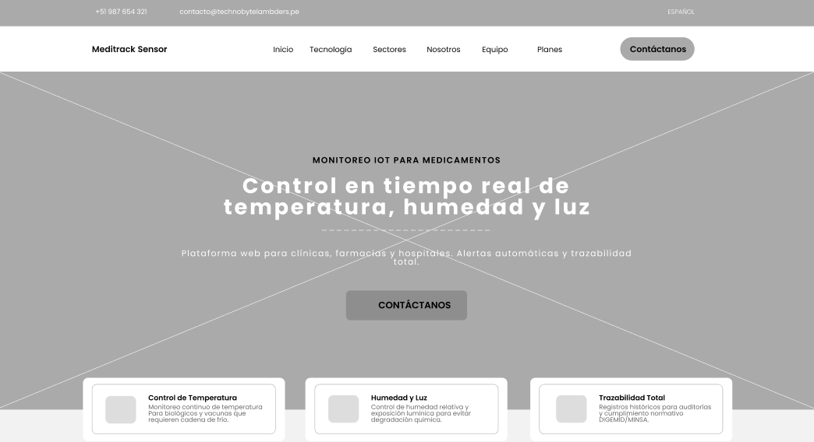

**Tecnología (How It Works)**

En esta sección se explica el funcionamiento del sistema, destacando la integración de sensores IoT
con la plataforma web. Se presentan las variables monitoreadas (temperatura, humedad y luz), así 
como el flujo de datos hacia dashboards en tiempo real. La información se organiza de manera clara 
para que el usuario comprenda cómo el sistema captura, procesa y presenta los datos.

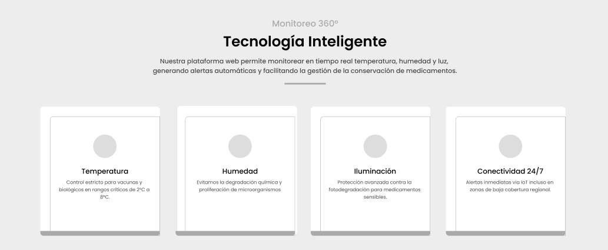

**Beneficios del sistema**

Esta sección describe el valor que ofrece MediTrack Sensor, enfocándose en la reducción de pérdidas 
por deterioro de medicamentos, la mejora en la trazabilidad y el cumplimiento de normativas sanitarias.
Se resaltan beneficios como alertas automáticas, acceso a información en tiempo real y disponibilidad 
de datos históricos para auditorías y toma de decisiones.

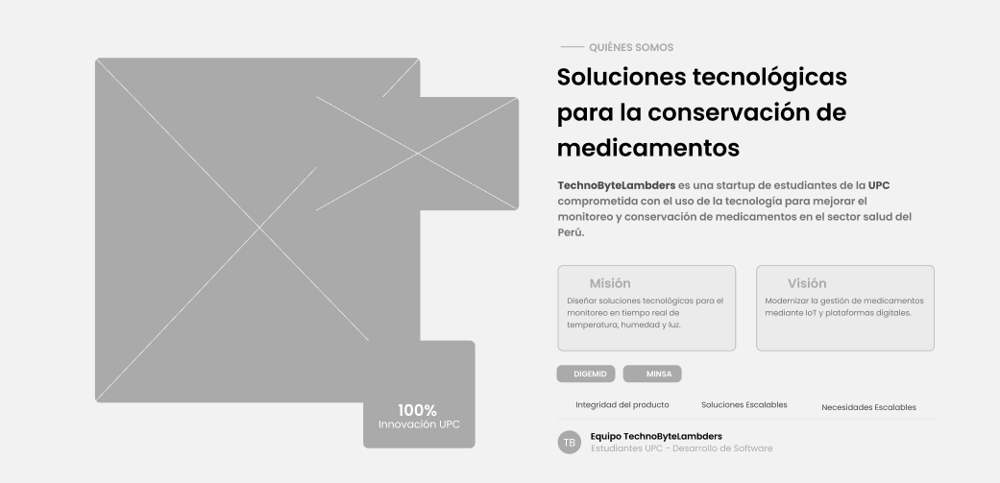

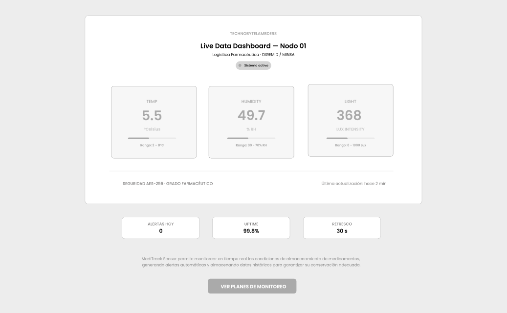

**Sectores (Aplicación del sistema)**

Aquí se presentan los distintos contextos donde el sistema puede ser aplicado, como hospitales, clínicas,
farmacias y centros de distribución. Cada segmento se describe brevemente, permitiendo que el usuario
identifique rápidamente cómo el producto se adapta a su entorno.

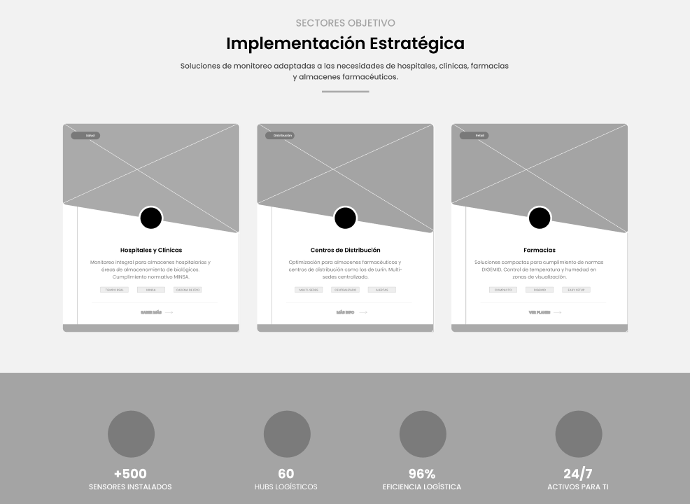

**Sobre el Equipo (Nosotros)**

Esta sección muestra al equipo detrás de MediTrack Sensor, incluyendo información relevante sobre sus 
integrantes. Su objetivo es generar confianza y credibilidad, humanizando la solución y mostrando el 
compromiso del equipo con el desarrollo del producto.

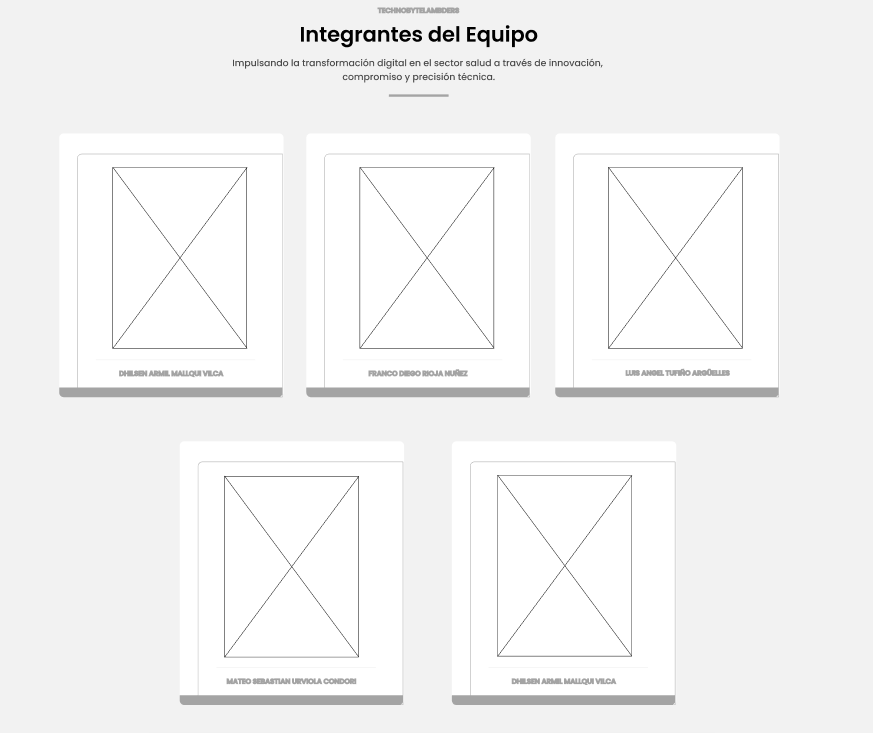

**Planes (Pricing)**

La sección de planes presenta las opciones de suscripción del sistema, organizadas según el número de 
sedes y funcionalidades disponibles. Se describen características como monitoreo en tiempo real, alertas,
acceso a historial y gestión centralizada, permitiendo al usuario identificar la opción más adecuada
según sus necesidades.

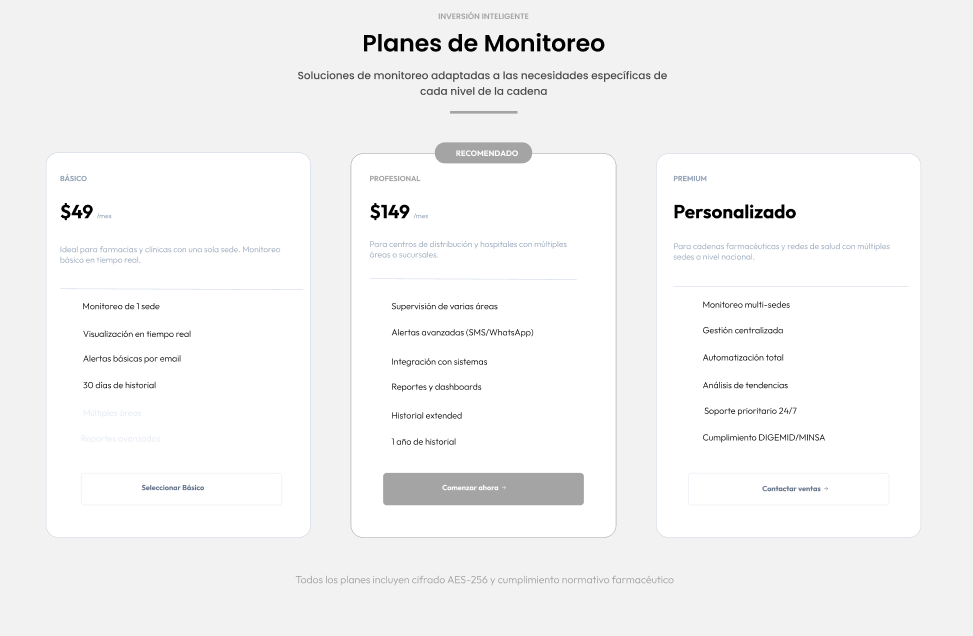

**Contacto**

En esta sección, los usuarios pueden establecer contacto directo con el equipo de MediTrack Sensor
para solicitar información adicional, resolver dudas o explorar oportunidades de implementación 
en sus instituciones. Se busca ofrecer un canal claro, accesible y confiable que facilite la comunicación
y permita a los interesados dar el siguiente paso hacia la adopción de una solución de monitoreo 
eficiente y adaptada al sector salud.

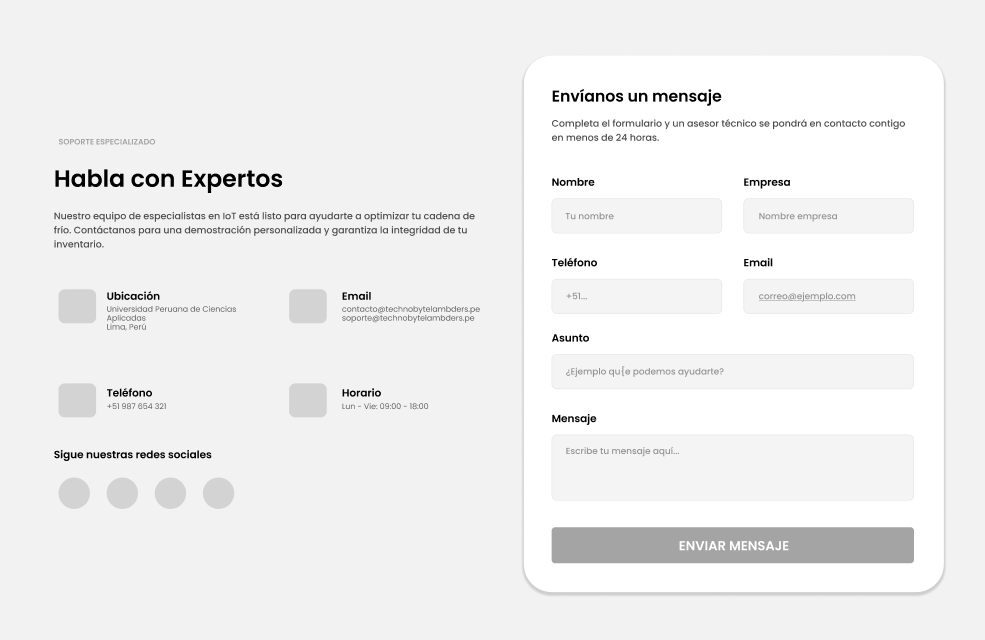

**Footer**

El pie de página incluye enlaces a información relevante como términos de servicio, políticas de privacidad
y medios de contacto. Este elemento proporciona un cierre estructurado a la página, permitiendo acceso 
rápido a información adicional sin afectar la claridad del diseño principal.

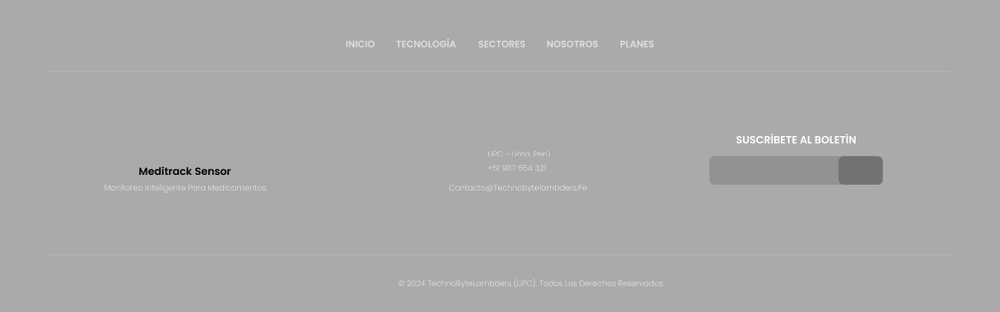

Este wireframe establece las bases para un diseño que no solo comunica la propuesta de valor de manera
efectiva, sino que también guía al usuario a través de una experiencia clara, funcional y alineada 
con las necesidades del sector salud.

### 4.3.2. Landing Page Mock-up

Los mockups de MediTrack Sensor representan la versión visual de alta fidelidad de la Landing Page, 
incorporando la identidad gráfica, paleta de colores y estilo visual del producto. La propuesta utiliza
como colores principales el azul oscuro #1B304C, asociado a confianza y estabilidad, y el naranja #E87239,
utilizado para resaltar información importante y llamados a la acción.

Asimismo, se incorporan imágenes relacionadas al entorno farmacéutico y al monitoreo de medicamentos, 
reforzando visualmente el enfoque del sistema en la seguridad, supervisión y control dentro del sector salud.

**Nav y Hero**

La sección principal presenta una interfaz moderna y limpia que comunica rápidamente la propuesta de valor 
de MediTrack Sensor. Se prioriza un mensaje claro sobre el monitoreo en tiempo real y se utiliza un llamado 
a la acción visible acompañado de elementos visuales relacionados al almacenamiento farmacéutico.

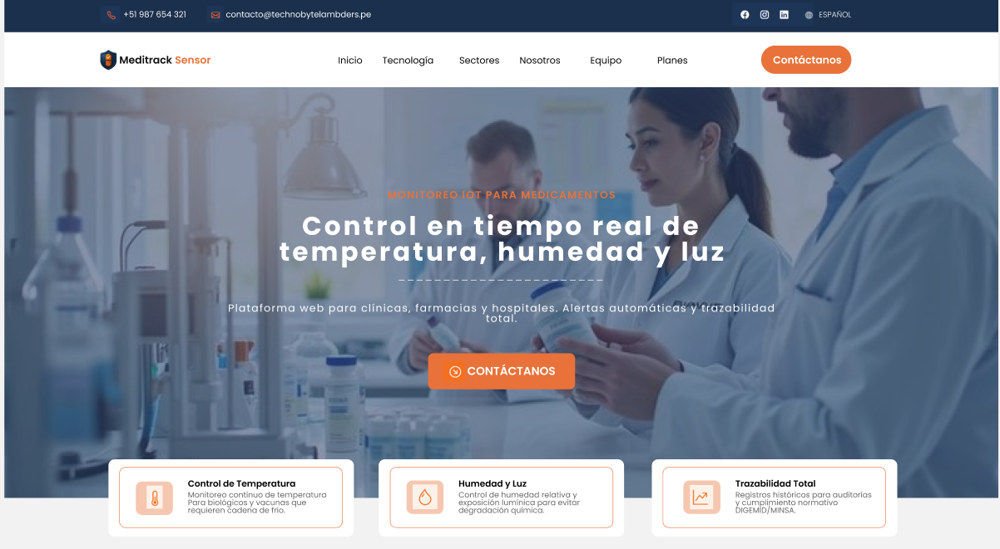

**Tecnología (How It Works)**

El mockup de esta sección muestra de forma visual el funcionamiento del sistema y la integración con sensores
IoT. Se utilizan íconos, tarjetas informativas y una estructura clara para facilitar la comprensión del flujo 
de monitoreo y procesamiento de datos.

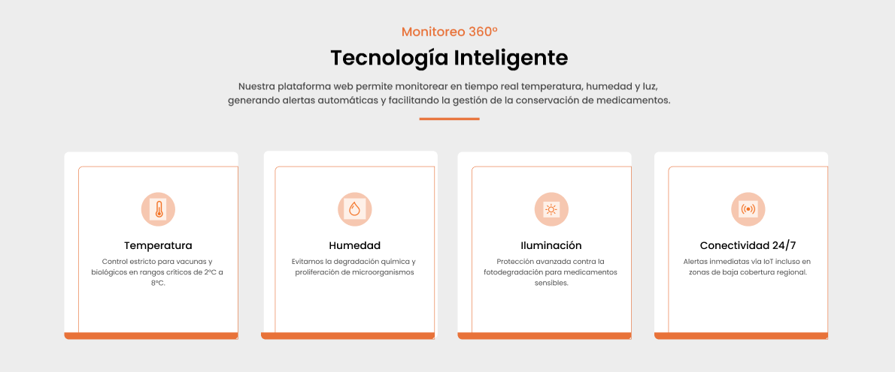

**Beneficios del sistema**

Esta sección resalta los beneficios principales mediante elementos visuales organizados y fáciles de identificar.
El diseño enfatiza conceptos como monitoreo continuo, alertas automáticas y trazabilidad de información.

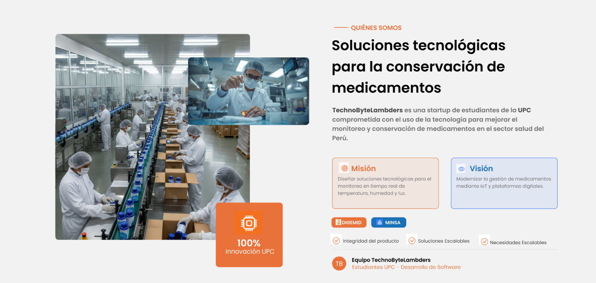

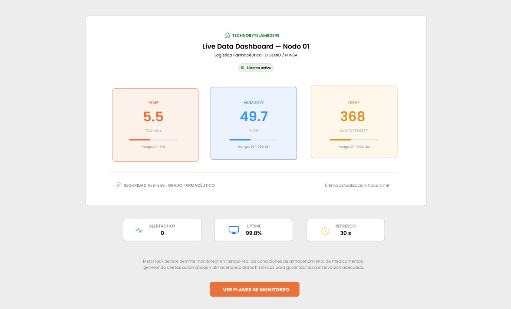

**Sectores (Aplicación del sistema)**

El diseño presenta los diferentes entornos donde MediTrack Sensor puede ser implementado, utilizando imágenes y 
bloques visuales que ayudan a identificar rápidamente cada sector objetivo.

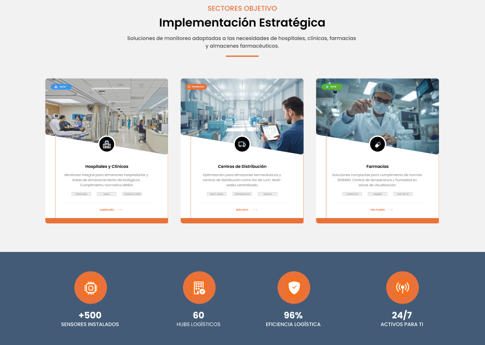

**Sobre el Equipo (Nosotros)**

Esta sección utiliza un diseño cercano y profesional para presentar a los integrantes del equipo. Se busca 
transmitir confianza y compromiso mediante fotografías y descripciones breves.

**Planes (Pricing)**

El mockup de planes organiza la información de manera clara y visualmente diferenciada, permitiendo comparar 
características y funcionalidades entre las distintas opciones de suscripción.

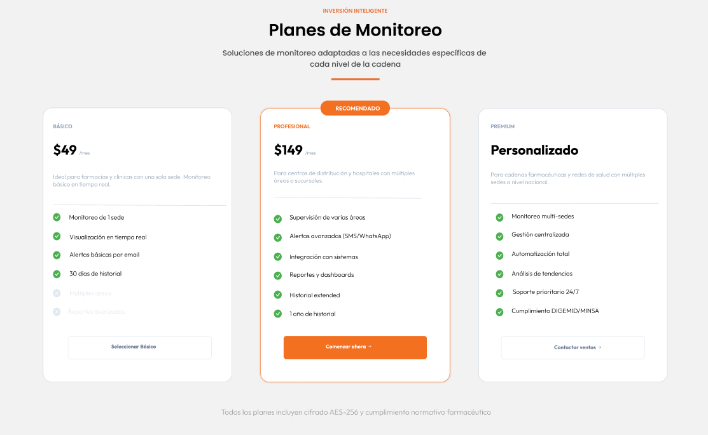

**Contacto**

La sección de contacto presenta un diseño accesible y ordenado que facilita la comunicación entre los usuarios 
y el equipo de MediTrack Sensor, manteniendo coherencia visual con el resto de la plataforma.

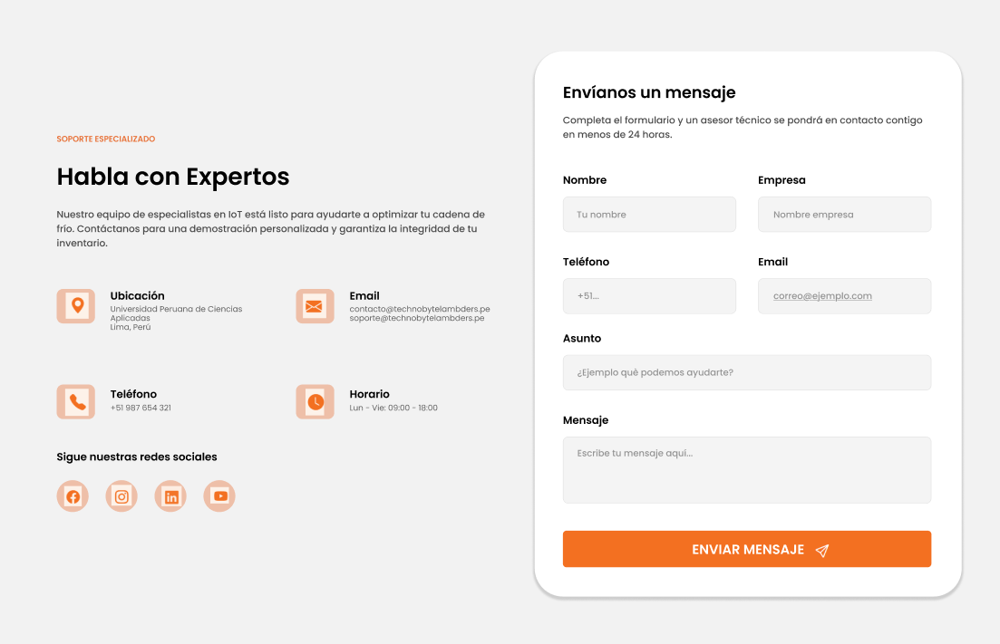

**Footer**

El footer mantiene una estructura limpia y funcional, integrando accesos rápidos a información relevante, 
enlaces de soporte y elementos de identidad institucional.

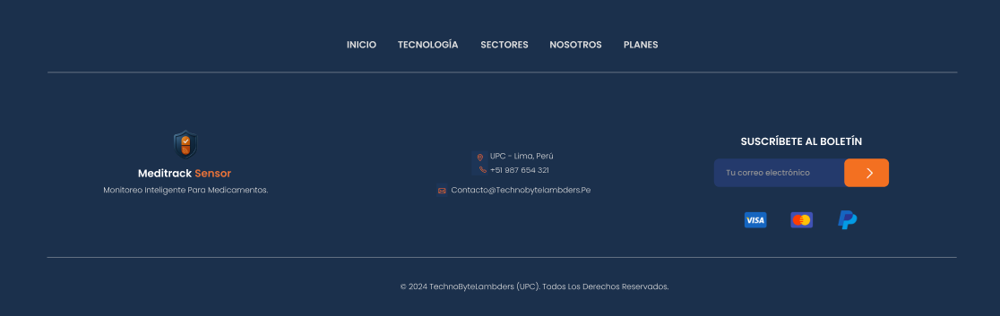

---

## 4.4. Web Applications UX/UI Design

### 4.4.1. Web Applications Wireframes

En esta sección se presentan los wireframes de la versión web de MediTrack Sensor,
organizados según los dos perfiles principales de usuario: personal operativo de almacenes
farmacéuticos y entidades de salud. Cada diseño está orientado a ofrecer una experiencia
clara, coherente y centrada en las necesidades de cada segmento, facilitando la supervisión
de condiciones ambientales, el acceso a información relevante y la toma de decisiones.
Asimismo, se busca asegurar una navegación intuitiva y fluida a lo largo de la plataforma.

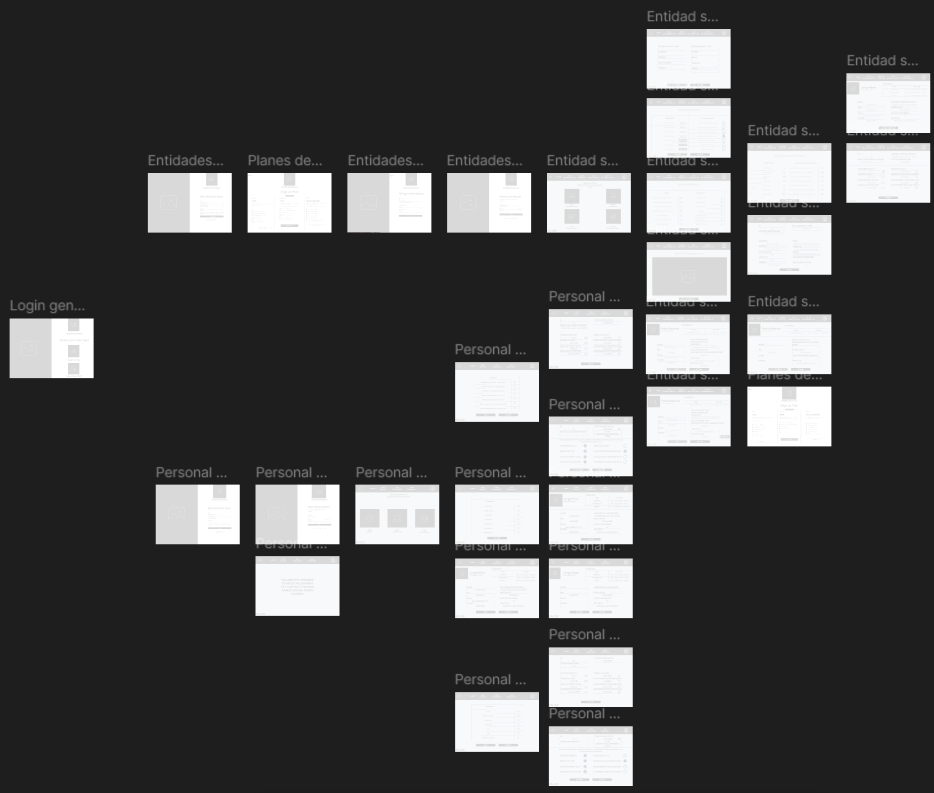

### 4.4.2. Web Applications Wireflow Diagrams

En esta sección se presentan los diagramas de flujo de interacción (wireflows) de 
la aplicación web de MediTrack Sensor, los cuales ilustran la navegación y las 
principales acciones que pueden realizar los distintos segmentos de usuarios dentro 
de la plataforma. Estos diagramas permiten visualizar cómo los usuarios interactúan con el sistema, 
facilitando la comprensión de la estructura funcional y de la experiencia de uso orientada al 
monitoreo de condiciones ambientales en tiempo real.

**Flujo tras inicio de sesión de Segmento Personal Operativo**

Este flujo representa el recorrido del personal operativo de almacenes farmacéuticos, enfocado en
la supervisión en tiempo real de condiciones ambientales. El usuario visualiza variables como 
temperatura, humedad y luz, detecta variaciones fuera de rango y registra incidencias.

**Flujo tras inicio de sesión de Segmento Entidades de Salud**

Este flujo describe la experiencia de entidades de salud y gestores farmacéuticos, quienes 
requieren una visión estratégica del sistema. Desde su panel, supervisan múltiples almacenes, 
acceden a datos históricos, analizan tendencias y apoyan la toma de decisiones.

### 4.4.3. Web Applications Mock-ups

### 4.4.4. Web Applications User Flow Diagrams

---

## 4.5. Web Applications Prototyping

---

## 4.6. Domain-Driven Software Architecture

### 4.6.1. Design-Level EventStorming

### 4.6.2. Software Architecture Context Diagram

### 4.6.3. Software Architecture Container Diagrams

### 4.6.4. Software Architecture Components Diagrams

---

## 4.7. Software Object-Oriented Design

### 4.7.1. Class Diagrams

---

## 4.8. Database Design

### 4.8.1. Database Diagrams

