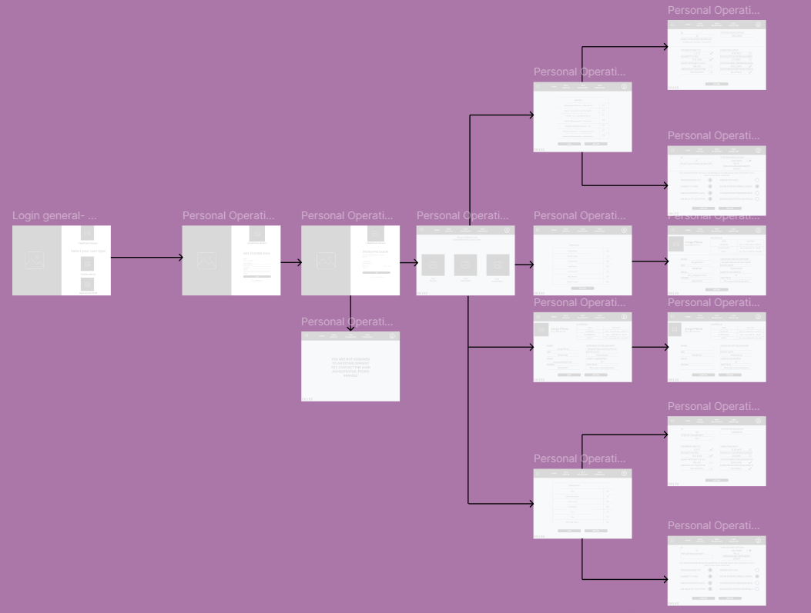
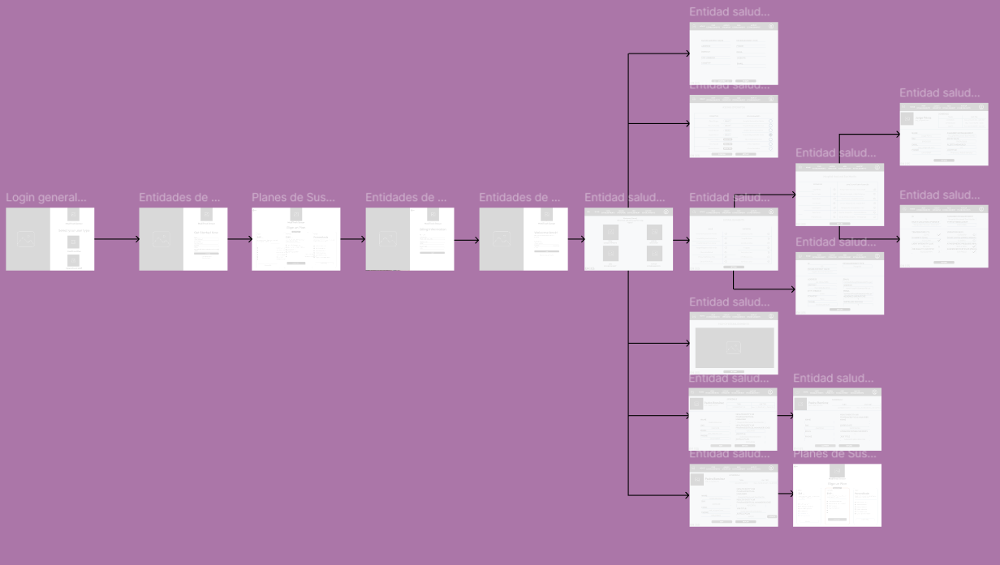

# Capítulo IV: Product Design

## 4.1. Style Guidelines

### 4.1.1. General Style Guidelines

### 4.1.2. Web Style Guidelines

---

## 4.2. Information Architecture

### 4.2.1. Organization Systems

### 4.2.2. Labeling Systems

### 4.2.3. SEO Tags and Meta Tags

### 4.2.4. Searching Systems

### 4.2.5. Navigation Systems

---

## 4.3. Landing Page UI Design

### 4.3.1. Landing Page Wireframe

### 4.3.2. Landing Page Mock-up

---

## 4.4. Web Applications UX/UI Design

### 4.4.1. Web Applications Wireframes

### 4.4.2. Web Applications Wireflow Diagrams

En esta sección se presentan los diagramas de flujo de interacción (wireflows) de 
la aplicación web de MediTrack Sensor, los cuales ilustran la navegación y las 
principales acciones que pueden realizar los distintos segmentos de usuarios dentro 
de la plataforma. Estos diagramas permiten visualizar cómo los usuarios interactúan con el sistema, 
facilitando la comprensión de la estructura funcional y de la experiencia de uso orientada al 
monitoreo de condiciones ambientales en tiempo real.

**Flujo tras inicio de sesión de Segmento Personal Operativo**

Este flujo representa el recorrido del personal operativo de almacenes farmacéuticos, enfocado en
la supervisión en tiempo real de condiciones ambientales. El usuario visualiza variables como 
temperatura, humedad y luz, detecta variaciones fuera de rango y registra incidencias.

**Flujo tras inicio de sesión de Segmento Entidades de Salud**

Este flujo describe la experiencia de entidades de salud y gestores farmacéuticos, quienes 
requieren una visión estratégica del sistema. Desde su panel, supervisan múltiples almacenes, 
acceden a datos históricos, analizan tendencias y apoyan la toma de decisiones.

### 4.4.3. Web Applications Mock-ups

### 4.4.4. Web Applications User Flow Diagrams

---

## 4.5. Web Applications Prototyping

---

## 4.6. Domain-Driven Software Architecture

### 4.6.1. Design-Level EventStorming

### 4.6.2. Software Architecture Context Diagram

### 4.6.3. Software Architecture Container Diagrams

### 4.6.4. Software Architecture Components Diagrams

---

## 4.7. Software Object-Oriented Design

### 4.7.1. Class Diagrams

---

## 4.8. Database Design

### 4.8.1. Database Diagrams
